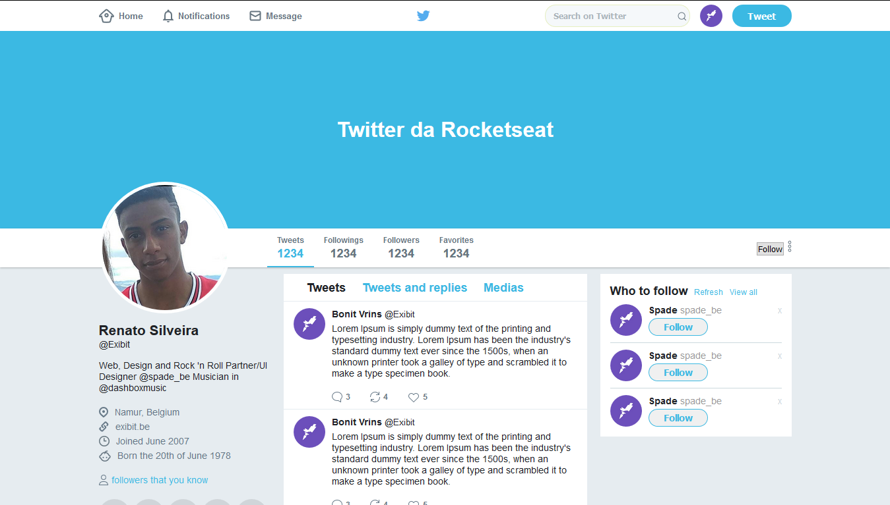

# Twitter Clone

This project is a web page that replicates the interface of Twitter using only HTML and CSS. It was developed as part of the Flexbox module in the GoStack bootcamp by @rocketseat.

## Features

- **Responsive Design**: Utilizes Flexbox to create a layout that adapts to different screen sizes.
- **Static Interface**: Mimics the core visual elements of Twitter's interface, including tweets, user profiles, and navigation.

## Screenshot



## Installation

No installation required. Simply clone the repository and open `index.html` in your web browser.

## Usage

1. Clone the repository:
   ```bash
   git clone https://github.com/renatosilveira99/Twitter-clone
   ```
2. Open `index.html` in a web browser to view the page.

## License

This project is licensed under the MIT License. See the [LICENSE](LICENSE) file for details.

## Acknowledgments

Special thanks to @rocketseat for the GoStack bootcamp and the Flexbox module.
